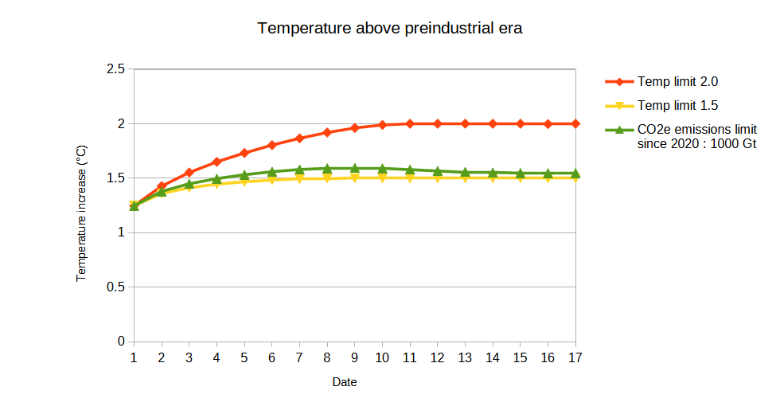

# DICE-with-carbon-budget
 A modified version of the GAMS DICE 2023 model with a constraint on the carbon budget (2020-2100) to 1000 GtCO2. (DICE 2023 can be found at https://williamnordhaus.com/dicerice-models)

## Changes with the original script

### Reduction of the time horizon

As the model was too heavy to run with my demonstration licence, I shortenned the time horizon to 2100, which represents 17 timesteps in the simulation model.

### Creation of a new variable and equations

In the `DICE2023-beta-3-17-3.gms` file, I added a new variable `CCO2ETOT(t)` representing the total CO2e emissions (including abateable nonCO2 GHG) since 2020 in GtCO2. Its values are set by the following lines :

```
cco2etoteq(t+1)..  CCO2ETOT(t+1) =E= CCO2ETOT(t) + ECO2E(T)*5;
cco2etot.fx(tfirst) = 0;
```

### Addition of a new variable to the ouputs

I added two lines in the file `includes/put_list_module-b-3-17.gms`, to plot `cco2etot` values.

```
put / "Cumulative CO2e emissions since 2020, GtC " ;
Loop (T, put cco2etot.l(t));
```

### Creation of the new scenario

I then created a new scenario by creating two new files `includes/def-CO2e1000-b-3-17.gms` and 
`includes/put-CO2e1000-b-3-17.gms`.

I added the following lines in the `DICE2023-beta-3-17-3.gms` file :

```
* 1000 Gt limit on 2020-2100 CO2 emissions
$include Include\def-CO2e1000-b-3-17.gms
$include Include\put-CO2e1000-b-3-17.gms
$include Include\put_list_module-b-3-17.gms
```

The file `includes/def-CO2e1000-b-3-17.gms` is inspired by the corresponding files in the 2°C scenario (`includes/def-CO2e1000-b-3-17.gms`). Instead of the limit on the athmospheric temperature, we added a limit on `cco2etot` values :

```
cco2etot.up(t)=1000;
```

To not modify the following scenarios in the scenarios execution order, I dropped the carbon budget constraint at the end of the file `includes/def-CO2e1000-b-3-17.gms`. To do so, I owerwrote the upper bound on cumulative CO2 emissions with a disproportionately large carbon budget (100000 GtC).

```
cco2etot.up(t)=100000;
```

## Results
 
Finally, I decided to compare this new scenario with the 1.5°C and 2°C scenarios.

The following chart presents the values of the variable `cco2etot` for the whole simulation.
We can see that in our new scenario, the mass of $CO_2$ emitted between 2020 and 2100 is effectively under 1000 Gt.


Finally, the following chart represents the evolution of the temperature in the thre scenarios.
we can see that the new scenario leads to a global warming of 1.55 degrees.

TODO : correct the bug in the temperatures (due to the fact the implemented carbon budget is between 01/01/2020 and 31/12/2100).

